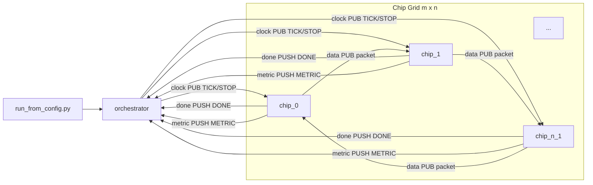
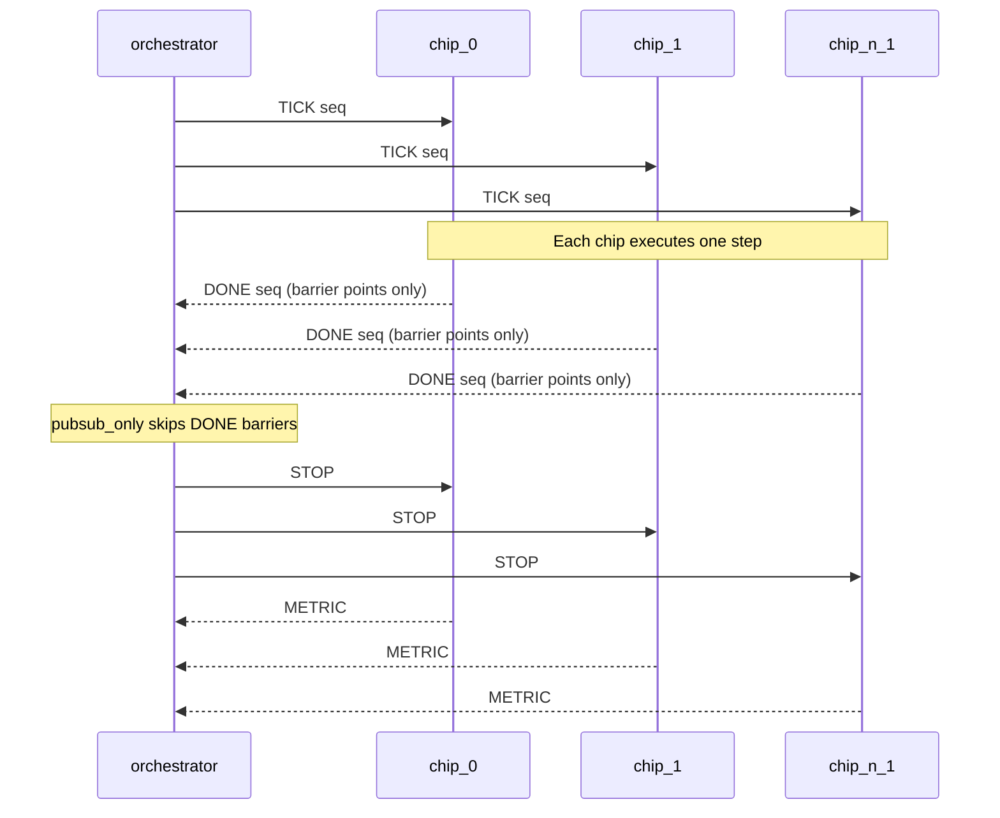
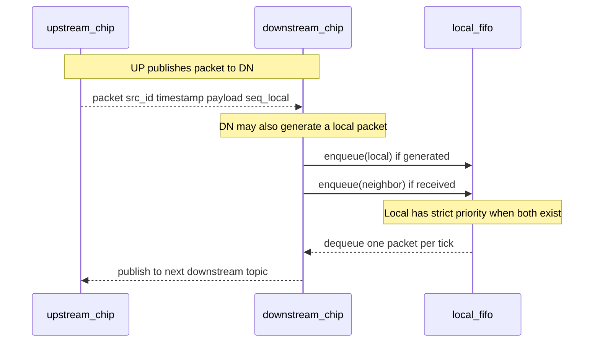

# chip_network_sim Architecture

## 1. Purpose and Scope
`chip_network_sim` simulates an `m x n` digital chip network where each chip:
- receives from at most one upstream neighbor (`input_id`),
- sends to at most one downstream neighbor (`out_id`),
- generates local traffic (`gen_ppm`),
- buffers traffic through a local FIFO.

The simulation supports:
- software FIFO backend (`build/chip`),
- RTL FIFO backend via Verilator (`build/chip_rtl`),
- orchestrated lockstep and non-lockstep run modes.

## 2. Repository Structure
```text
chip_network_sim/
  src/
    orchestrator.c     # Launches all chip processes and drives ticks
    chip.c             # Software FIFO chip runtime
    chip_rtl.cpp       # Verilated RTL chip runtime
    fifo.c             # Software FIFO implementation
    protocol.c         # Sync-mode parsing helpers
  include/chipsim/
    protocol.h         # Packet/control message structs
    fifo.h             # FIFO API
  rtl/
    chip_fifo_router.sv # 2-input, 1-output FIFO router RTL
  scripts/
    run_from_config.py # JSON -> orchestrator CLI expansion
    chip_wrapper.py
  config/
    *.json             # Topology + traffic + runtime scenarios
  doc/
    Doxyfile
    pandoc.yaml
    architecture.md
```

## 3. Component Architecture


## 4. Build and Backend Model
### 4.1 Software path
- `src/chip.c` uses `chipsim_fifo_t` from `src/fifo.c`.
- Local-first ingress arbitration is implemented in software.

### 4.2 RTL path
- `rtl/chip_fifo_router.sv` is Verilated and linked with `src/chip_rtl.cpp`.
- `chip_rtl` drives RTL signals per tick and exchanges data/control over `nng`.

### 4.3 Common transport
- Clock channel: orchestrator `PUB` -> chips `SUB`.
- Data channel: per-chip `PUB`/`SUB` sockets.
- Done/metric channels: chips `PUSH` -> orchestrator `PULL`.

## 5. Configuration Model
Primary JSON fields:
- `grid.rows`, `grid.cols`
- `runtime`: `ticks`, `sync_mode`, `ack_window`, `fifo_depth`, `seed`, `chip_bin`
- `traffic.gen_ppm`: global default generation rate
- `routes[]`: explicit per-chip wiring and optional per-chip generation override

Route entry schema:
```json
{ "id": 7, "input_id": 6, "out_id": 3, "gen_ppm": 140000 }
```

Conventions:
- `input_id: -1` -> no upstream neighbor input.
- `out_id: -1` -> no downstream neighbor (sink).
- `gen_ppm` in a route entry overrides global `traffic.gen_ppm`.

## 6. Chip ID Assignment
Row-major mapping:
- `id = row * cols + col`

Example (`rows=3`, `cols=4`):
```text
+----+----+----+----+
|  0 |  1 |  2 |  3 |
+----+----+----+----+
|  4 |  5 |  6 |  7 |
+----+----+----+----+
|  8 |  9 | 10 | 11 |
+----+----+----+----+
```

## 7. Data and Control Message Model
Defined in `include/chipsim/protocol.h`.

| Message | Type ID | Producer | Consumer | Purpose |
|---|---:|---|---|---|
| `chipsim_tick_msg_t` | `CHIPSIM_MSG_TICK=1` | orchestrator | all chips | Advance one simulation step |
| `chipsim_tick_msg_t` | `CHIPSIM_MSG_STOP=2` | orchestrator | all chips | End run and flush final metrics |
| `chipsim_done_msg_t` | `CHIPSIM_MSG_DONE=3` | chip | orchestrator | Barrier acknowledgement and counters |
| `chipsim_metric_msg_t` | `CHIPSIM_MSG_METRIC=4` | chip | orchestrator | End-of-run metrics |

Packet payload (`chipsim_packet_t`):
- `src_id`, `timestamp`, `payload`, `seq_local`.

### 7.1 Control Message Passing


### 7.2 Data Message Passing


## 8. Tick Execution Semantics
## 8.1 Orchestrator loop (`src/orchestrator.c`)
Per tick:
1. Build and send `TICK(seq)`.
2. If sync mode requires barrier at this tick:
   - wait for all chips to return `DONE(seq)`.
3. Repeat until `ticks` reached.
4. Send one `STOP`.
5. Collect one `METRIC` from each chip.

## 8.2 Software chip loop (`src/chip.c`)
Per tick:
1. Receive `TICK`.
2. Nonblocking receive neighbor packet (if configured).
3. Generate local packet probabilistically using `gen_ppm`.
4. Pop one packet from FIFO for output publication.
5. Enqueue local first, then neighbor packet.
6. Emit `DONE` when required by sync mode.

## 8.3 RTL chip loop (`src/chip_rtl.cpp`)
Per tick:
1. Receive `TICK`.
2. Gather neighbor and local packet candidates.
3. Sample current `out_valid/out_data` from RTL.
4. Drive `local_valid/local_data`, `neigh_valid/neigh_data`, `out_ready=1`.
5. Tick Verilator model.
6. Publish sampled output packet.
7. Read `drop_local/drop_neigh/occupancy`; update metrics.
8. Emit `DONE` when required by sync mode.

## 9. Sync Modes and Timing Behavior
## 9.1 `barrier_ack`
- Strict lockstep: wait for all chips every tick.

```text
Orchestrator:  TICK(100) ---> chips
Chips:         work tick 100
Chips:         DONE(100) ---> orchestrator (all chips)
Orchestrator:  TICK(101) only after all DONE(100)
```

## 9.2 `windowed_ack`
- Lockstep at every `ack_window` boundary.
- Example `ack_window=8`: wait on ticks 7, 15, 23, ...

```text
Ticks 0..6:  fire-and-forget TICK
Tick 7:      wait for DONE(7) from all chips
Ticks 8..14: fire-and-forget TICK
Tick 15:     wait for DONE(15) from all chips
```

## 9.3 `pubsub_only`
- No DONE barrier.
- Highest throughput, weakest synchronization fidelity.

```text
Orchestrator: TICK(0), TICK(1), ... continuously
Chips: consume at own pace
```

## 10. FIFO Behavior
### 10.1 Software FIFO (`src/fifo.c`)
- Ring buffer, bounded by `capacity`.
- Push returns `0` when full.

### 10.2 RTL FIFO (`rtl/chip_fifo_router.sv`)
- Bounded by `cfg_fifo_depth` and module `DEPTH`.
- Local ingress has strict priority over neighbor ingress.
- On full condition, `drop_local`/`drop_neigh` pulse accordingly.

## 11. Runtime Metrics and Instrumentation
Collected totals:
- `tx`, `rx`, `local_gen_count`, `drop_count`, `fifo_peak`.

Orchestrator timing instrumentation:
- `total_sec`, `setup_sec`, `tick_loop_sec`, `shutdown_sec`
- `cycles_per_sec`
- `tick_send_sec`, `tick_wait_sec`, `tick_wait_pct`, `ack_barriers`

This is printed at end of each run and used by `BENCHMARKS.md`.

## 12. 300k-Tick Performance Snapshot (RTL, 3x4 snake)
From `BENCHMARKS.md`:

| Mode | Cycles/sec | Drops | Local generated | Note |
|---|---:|---:|---:|---|
| `barrier_ack` | 4060.610 | 128494 | 429648 | Strictest synchronization |
| `windowed_ack` | 6879.062 | 127773 | 429648 | Better throughput with periodic barrier |
| `pubsub_only` | 12081.460 | 84191 | 288836 | Fastest, but not behaviorally equivalent |

Interpretation:
- Global per-tick orchestration is a major cost center.
- Windowed barriers offer a pragmatic fidelity/performance compromise.
- `pubsub_only` reduces orchestration cost but changes effective simulation behavior.

## 13. Documentation Build Commands
From `doc/`:
```bash
make html        # doc/build/architecture.html
make pdf         # doc/build/architecture.pdf (needs xelatex)
make doxygen     # doc/build/doxygen/html/index.html
```
