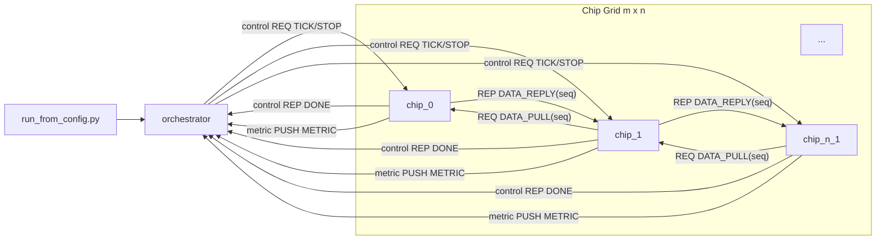
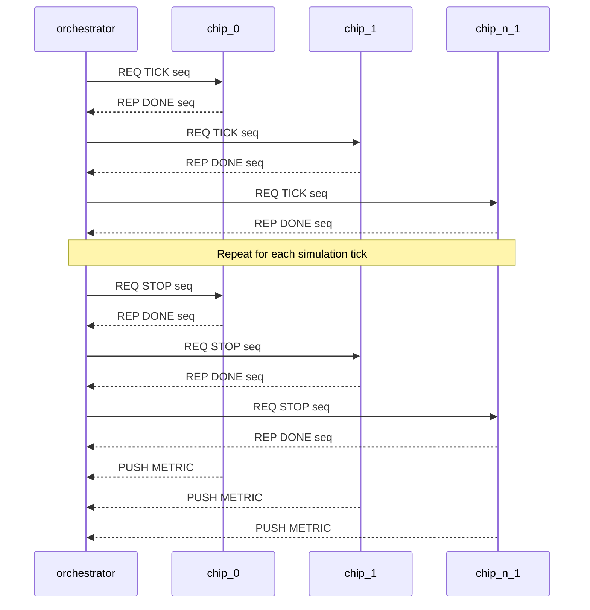
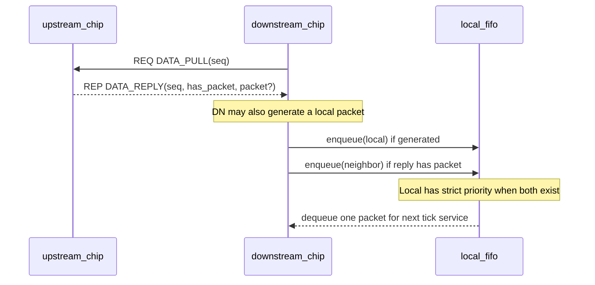

# chip_network_sim Architecture

## 1. Purpose and Scope
`chip_network_sim` simulates an `m x n` digital chip network where each chip:
- receives from at most one upstream neighbor (`input_id`),
- sends to at most one downstream neighbor (`out_id`),
- generates local traffic (`gen_ppm`),
- buffers traffic through a local FIFO.

The simulation supports:
- software FIFO backend (`build/chip`),
- RTL FIFO backend via Verilator (`build/chip_rtl`),
- orchestrated transactional lock-step control.

## 2. Repository Structure
```text
chip_network_sim/
  src/
    orchestrator.c     # Launches all chip processes and drives ticks
    chip.c             # Software FIFO chip runtime
    chip_rtl.cpp       # Verilated RTL chip runtime
    fifo.c             # Software FIFO implementation
    protocol.c         # Protocol translation unit (message structs in protocol.h)
    trace.c            # Minimal binary trace writer
  include/chipsim/
    protocol.h         # Packet/control message structs
    fifo.h             # FIFO API
    trace.h            # Trace schema and writer API
  rtl/
    chip_fifo_router.sv # 2-input, 1-output FIFO router RTL
  scripts/
    run_from_config.py # JSON -> orchestrator CLI expansion
    reconstruct_trace.py # Trace summary + ASCII timeline plots
    chip_wrapper.py
  config/
    *.json             # Topology + traffic + runtime scenarios
  doc/
    Doxyfile
    pandoc.yaml
    architecture.md
```

## 3. Component Architecture


## 4. Build and Backend Model
### 4.1 Software path
- `src/chip.c` uses `chipsim_fifo_t` from `src/fifo.c`.
- Local-first ingress arbitration is implemented in software.

### 4.2 RTL path
- `rtl/chip_fifo_router.sv` is Verilated and linked with `src/chip_rtl.cpp`.
- `chip_rtl` drives RTL signals per tick and exchanges data/control over `nng`.

### 4.3 Common transport
- Control channel: orchestrator `REQ` -> per-chip `REP` (`TICK/STOP` request, `DONE` response).
- Data channel: per-link `REQ`/`REP` pull (`DATA_PULL(seq)` -> `DATA_REPLY(seq)`).
- Metric channel: chips `PUSH` -> orchestrator `PULL`.

## 5. Configuration Model
Primary JSON fields:
- `grid.rows`, `grid.cols`
- `runtime`: `ticks`, `fifo_depth`, `seed`, `chip_bin`, `startup_ms`, `ack_timeout_ms`,
  `trace_dir?`, `trace_run_id?`
- `traffic.gen_ppm`: global default generation rate
- `routes[]`: explicit per-chip wiring and optional per-chip generation override

Route entry schema:
```json
{ "id": 7, "input_id": 6, "out_id": 3, "gen_ppm": 140000 }
```

Conventions:
- `input_id: -1` -> no upstream neighbor input.
- `out_id: -1` -> no downstream neighbor (sink).
- `gen_ppm` in a route entry overrides global `traffic.gen_ppm`.

## 6. Chip ID Assignment
Row-major mapping:
- `id = row * cols + col`

Example (`rows=3`, `cols=4`):
```text
+----+----+----+----+
|  0 |  1 |  2 |  3 |
+----+----+----+----+
|  4 |  5 |  6 |  7 |
+----+----+----+----+
|  8 |  9 | 10 | 11 |
+----+----+----+----+
```

## 7. Data and Control Message Model
Defined in `include/chipsim/protocol.h`.

| Message | Type ID | Producer | Consumer | Purpose |
|---|---:|---|---|---|
| `chipsim_tick_msg_t` | `CHIPSIM_MSG_TICK=1` | orchestrator | all chips | Advance one simulation step |
| `chipsim_tick_msg_t` | `CHIPSIM_MSG_STOP=2` | orchestrator | all chips | End run and flush final metrics |
| `chipsim_done_msg_t` | `CHIPSIM_MSG_DONE=3` | chip | orchestrator | Barrier acknowledgement and counters |
| `chipsim_metric_msg_t` | `CHIPSIM_MSG_METRIC=4` | chip | orchestrator | End-of-run metrics |
| `chipsim_data_pull_msg_t` | `CHIPSIM_MSG_DATA_PULL=5` | downstream chip | upstream chip | Request packet for tick `seq` |
| `chipsim_data_reply_msg_t` | `CHIPSIM_MSG_DATA_REPLY=6` | upstream chip | downstream chip | Reply with `has_packet` and packet payload |

Packet payload (`chipsim_packet_t`):
- `src_id`, `timestamp`, `payload`, `seq_local`.

### 7.1 Control Message Passing


### 7.2 Data Message Passing


### 7.3 Inter-chip Reliable Data Implementation Notes (Annotated)
Data transport uses `nng` `REQ/REP` per link:
- each chip with `out_id >= 0` listens on one data `REP` endpoint (`my_data_url`);
- each chip with `input_id >= 0` dials upstream with one data `REQ` socket (`input_data_url`).

Message layout (`include/chipsim/protocol.h`):
```c
typedef struct {
    uint8_t  type;         // CHIPSIM_MSG_DATA_PULL
    uint32_t requester_id; // downstream chip id
    uint64_t seq;          // requested tick
} chipsim_data_pull_msg_t;

typedef struct {
    uint8_t          type;         // CHIPSIM_MSG_DATA_REPLY
    uint8_t          has_packet;   // 1 => packet valid
    uint32_t         responder_id; // upstream chip id
    uint64_t         seq;          // reply tick
    chipsim_packet_t packet;       // valid iff has_packet == 1
} chipsim_data_reply_msg_t;
```

Endpoint binding and dial logic (`src/chip.c`, same pattern in `src/chip_rtl.cpp`):
```c
// Upstream service endpoint.
nng_rep0_open(&data_rep);
nng_listen(data_rep, my_data_url, NULL, 0);

// Downstream pull client.
nng_req0_open(&data_req);
nng_dial(data_req, input_data_url, NULL, NNG_FLAG_NONBLOCK);
```
Notes:
- `my_data_url` is built from `data_prefix` + `id` (or `printf` `%d` pattern).
- `input_data_url` is built from `data_prefix` + `input_id`.
- request path uses timeout and `seq`/peer-id validation in each tick.
- one service thread handles inbound `DATA_PULL` requests while the main simulation thread runs the tick loop.

Per-tick data path in software chip (`src/chip.c`):
```c
// 1) Pop one packet and publish it into local service state for this seq.
have_out = chipsim_fifo_pop(&fifo, &out_packet) > 0;
data_server_publish(&data_state, tick.seq, have_out, have_out ? &out_packet : NULL);

// 2) Pull exactly one packet from upstream for this seq.
if (has_input) {
    pull_from_upstream(data_req, &opts, tick.seq, &neighbor_packet, &have_neighbor);
}
```
Notes:
- Current model is single-rate per link: one pull/reply opportunity per tick.
- Local generation and upstream ingress contend for FIFO; local ingress is pushed first by design.

Per-tick data path in RTL chip (`src/chip_rtl.cpp`):
```c
// 1) Sample current RTL output and publish as this seq service state.
emit_valid = (model->out_valid != 0);
if (emit_valid) { out_packet = unpack_packet(model->out_data); }
data_server_publish(&data_state, tick.seq, emit_valid, emit_valid ? &out_packet : NULL);

// 2) Pull neighbor packet for this seq and drive neigh_* inputs.
pull_from_upstream(data_req, &opts, tick.seq, &neighbor_packet, &have_neighbor);
```
Notes:
- `emit_valid/emit_word` are sampled before `tick_model` and served under current `seq`.
- This mirrors cycle-based RTL behavior while keeping the same network contract as software chip.

## 8. Tick Execution Semantics
## 8.1 Exact lock-step control (`src/orchestrator.c`)
For each `seq` in `0..ticks-1`:
1. Build control message `TICK(seq)`.
2. Send `REQ TICK(seq)` to every chip control socket.
3. Receive one `REP DONE(seq)` from every chip.
4. Validate each reply:
   - `type == CHIPSIM_MSG_DONE`,
   - `chip_id` matches the expected chip index,
   - `seq` equals the current tick.
5. Advance to `seq + 1` only when all chips replied with valid `DONE(seq)`.

Stop phase:
1. Send `REQ STOP(seq=ticks)` to every chip.
2. Receive and validate one `REP DONE(seq=ticks)` from every chip.
3. Collect one final `METRIC` message from every chip.

## 8.2 Orchestrator Threading and Internal Structure
- Application-level threading model: single-threaded.
- `src/orchestrator.c` does not create worker threads (`pthread`/`std::thread` are not used).
- Concurrency comes from child processes (`fork` + `exec`) and socket I/O to all chip processes.
- `nng` may use internal transport threads, but orchestration logic itself runs on one main control loop.

Main phases in one orchestrator process:
1. Parse CLI/config-expanded args.
2. Build route/gen maps and endpoint URLs.
3. Launch `rows * cols` chip processes.
4. Open one control `REQ` socket per chip and one metric `PULL` socket.
5. Execute lock-step tick loop (`TICK` fanout, `DONE` gather/validate).
6. Execute stop barrier (`STOP` fanout, `DONE` gather/validate).
7. Collect final `METRIC` messages, wait child exits, print benchmark totals.

## 8.3 Software chip loop (`src/chip.c`)
Per tick:
1. Receive control `REQ TICK`.
2. Pop one packet from FIFO and publish it to data service state for current `seq`.
3. Pull neighbor packet with `REQ DATA_PULL(seq)` (if configured).
4. Generate local packet probabilistically using `gen_ppm`.
5. Enqueue local first, then neighbor packet.
6. Reply `REP DONE` for that tick.

## 8.4 RTL chip loop (`src/chip_rtl.cpp`)
Per tick:
1. Receive control `REQ TICK`.
2. Sample current `out_valid/out_data` from RTL and publish into data service state.
3. Pull neighbor packet with `REQ DATA_PULL(seq)` and build `neigh_data`.
4. Build local packet candidate and drive `local_valid/local_data`, `neigh_valid/neigh_data`, `out_ready=1`.
5. Tick Verilator model.
6. Read `drop_local/drop_neigh/occupancy`; update metrics.
7. Reply `REP DONE` for that tick.

## 9. Lock-Step Guarantees and Failure Behavior
- There is no runtime-selectable sync mode. Control always uses transactional lock-step.
- A chip cannot execute tick `N+1` until orchestrator has completed the `TICK(N)` transaction.
- If any `TICK` send, `DONE` receive, or `DONE` validation fails, orchestrator aborts the run.
- `ack_timeout_ms` bounds per-message wait time for control and metric channels.

## 10. FIFO Behavior
### 10.1 Software FIFO (`src/fifo.c`)
- Ring buffer, bounded by `capacity`.
- Push returns `0` when full.

### 10.2 RTL FIFO (`rtl/chip_fifo_router.sv`)
- Bounded by `cfg_fifo_depth` and module `DEPTH`.
- Local ingress has strict priority over neighbor ingress.
- On full condition, `drop_local`/`drop_neigh` pulse accordingly.

## 11. Runtime Metrics and Instrumentation
Collected totals:
- `tx`, `rx`, `local_gen_count`, `drop_count`, `fifo_peak`.

Orchestrator timing instrumentation:
- `total_sec`, `setup_sec`, `tick_loop_sec`, `shutdown_sec`
- `cycles_per_sec`
- `tick_send_sec`, `tick_wait_sec`, `tick_wait_pct`, `ack_barriers`

This is printed at end of each run and used by `BENCHMARKS.md`.

## 12. Packet Trace (Minimal Binary)
Tracing is optional and enabled at orchestrator launch:
- `-trace_dir <path>`
- `-trace_run_id <id>` (optional; auto-generated if omitted)

Orchestrator behavior when enabled:
- creates `traces/<run_id>/`,
- writes `manifest.json`,
- passes per-chip `-trace_file traces/<run_id>/chip_<id>.tracebin`.

Trace row schema (`include/chipsim/trace.h`):
- fixed 24-byte records,
- fields: `tick`, `event_type`, `fifo_occupancy`, `packet_word`,
- `packet_word` is intentionally at struct tail for forward extension.

Event types:
- `GEN_LOCAL`
- `ENQ_LOCAL_OK`
- `ENQ_LOCAL_DROP_FULL`
- `ENQ_NEIGH_OK`
- `ENQ_NEIGH_DROP_FULL`
- `DEQ_OUT`

Offline reconstruction:
- Summary:
  - `python3 scripts/reconstruct_trace.py -run traces/<run_id> --top 20`
- ASCII packet columns:
  - `python3 scripts/reconstruct_trace.py -run traces/<run_id> --plot-top 4 --plot-out <file>`
- ASCII chip lanes (single packet):
  - `python3 scripts/reconstruct_trace.py -run traces/<run_id> --plot-mode chip-lanes --plot-packets <packet_word> --plot-out <file>`

## 13. Performance Snapshot
From `BENCHMARKS.md`:

| Topology | Backend | Ticks | Tick loop sec | Cycles/sec | Tick wait sec | Wait % |
|---|---|---:|---:|---:|---:|---:|
| `2x2` custom routes | `chip_rtl` | 5000 | 0.932326 | 5362.934 | 0.771901 | 82.79% |
| `2x2` custom routes | `chip` | 5000 | 0.786081 | 6360.670 | 0.625263 | 79.54% |
| `3x4` snake to top-left | `chip_rtl` | 10000 | 3.335390 | 2998.150 | 2.101491 | 63.01% |
| `3x4` snake to top-left | `chip` | 10000 | 3.281213 | 3047.654 | 2.046102 | 62.36% |
| `3x4` snake to top-left | `chip_rtl` | 300000 | 84.342902 | 3556.909 | 46.454093 | 55.08% |

Interpretation:
- `ack_barriers == ticks` confirms strict per-tick lock-step.
- throughput scales down with topology size as data-transaction and lock-step overhead grow.
- `chip` and `chip_rtl` are close on `3x4` at 10k ticks.
- see `BENCHMARKS.md` for historical pre-migration 300k baseline.

## 14. Documentation Build Commands
From `doc/`:
```bash
make html        # doc/build/architecture.html
make pdf         # doc/build/architecture.pdf (needs xelatex)
make doxygen     # doc/build/doxygen/html/index.html
```
