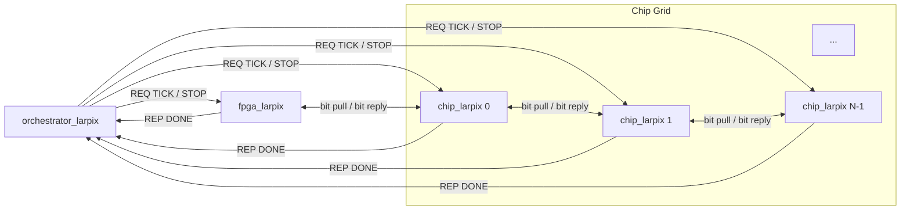

# chip_network_sim Architecture

## 1. Scope
`chip_network_sim` now refers to the LArPix network simulator only. The repository models a grid of LArPix-like chip runtimes coordinated by a process-level orchestrator in strict global lock-step.

Each live runtime can:
- exchange serial bits with up to four neighbors,
- accept startup/configuration traffic from an FPGA/controller runtime,
- inject local analog stimulus through a software analog-front-end model,
- drive a Verilated digital core,
- emit trace and debug artifacts.

## 2. Repository Structure
```text
chip_network_sim/
  CMakeLists.txt
  larpix_network_sim/
    src/
      orchestrator_larpix.c
      chip_larpix.cpp
      fpga_larpix.cpp
      trace_collector_larpix.c
      larpix_cosim_backend.cpp
      analog_core_model.cpp
    include/
      chipsim/
        protocol.h
        trace.h
      larpixsim/
        backend.h
        trace_protocol.h
    config/
      startup_*.json
      stimulus_*.json
      CONFIGURATION_TESTS.md
      WORKFLOW.md
    scripts/
      run_*.sh
      generate_*.py
      compile_startup_json.py
    larpix_v3b_rtl/
      src/
```

## 3. Runtime Topology

```mermaid
flowchart LR
    O["orchestrator_larpix"]
    F["fpga_larpix"]

    subgraph GRID["Chip Grid"]
      C0["chip_larpix 0"]
      C1["chip_larpix 1"]
      C2["..."]
      CN["chip_larpix N-1"]
    end

    O -->|"REQ TICK / STOP"| F
    F -->|"REP DONE"| O

    O -->|"REQ TICK / STOP"| C0
    O -->|"REQ TICK / STOP"| C1
    O -->|"REQ TICK / STOP"| CN

    C0 -->|"REP DONE"| O
    C1 -->|"REP DONE"| O
    CN -->|"REP DONE"| O

    F <-->|"bit pull / bit reply"| C0
    C0 <-->|"bit pull / bit reply"| C1
    C1 <-->|"bit pull / bit reply"| CN
```

## 4. Core Components
### 4.1 `orchestrator_larpix`
- Launches one chip process per grid position.
- Optionally launches `fpga_larpix`.
- Builds the control-plane and per-edge IPC endpoints.
- Drives the run with exact `TICK(seq)` / `DONE(seq)` barrier semantics.
- Optionally launches `trace_collector_larpix`.

### 4.2 `chip_larpix`
- Owns one chip runtime instance.
- Maintains four directional bit interfaces.
- Pulls per-edge input bits and publishes per-edge output bits.
- Loads optional stimulus and register preload JSON.
- Bridges the transport layer to the selected backend implementation.

### 4.3 `fpga_larpix`
- Injects startup/configuration UART traffic into the designated source chip.
- Receives returning UART packets from that same edge.
- Participates in the same lock-step protocol as every chip runtime.

### 4.4 `larpix_cosim_backend`
- Wraps the Verilated `digital_core` RTL.
- Couples the digital core to the software analog model.
- Samples FIFO/debug state exposed by the RTL.

### 4.5 `analog_core_model`
- Provides the software analog front-end used during live cosim runs.
- Converts configured thresholds, charge injection, and sampling signals into `hit`, `done`, and ADC outputs for the RTL core.

## 5. Control and Data Model
Shared control/message structs live under `larpix_network_sim/include/chipsim/`.

Control plane:
- orchestrator sends `TICK(seq)` to each runtime,
- each runtime advances exactly one modeled step,
- each runtime replies `DONE(seq)`,
- orchestrator validates all replies before advancing.

Data plane:
- communication is per-edge and bit-serial,
- neighbors exchange one bit-pull / bit-reply transaction per edge per tick,
- the FPGA uses the same bit-serial edge transport to inject startup traffic.

## 6. Trace and Debug Outputs
The live LArPix path supports:
- JSONL event traces through `trace_collector_larpix`,
- occupancy CSV capture for one selected runtime,
- RX/Hydra debug CSV capture for one selected runtime.

Trace collection is intentionally separated from the orchestrator so the orchestrator remains focused on process launch and lock-step sequencing.

## 7. Build Model
Always-built targets:
- `orchestrator_larpix`
- `fpga_larpix`
- `trace_collector_larpix`

Verilator-dependent target:
- `chip_larpix` via `chip_larpix_build`

The build no longer exposes the retired generic packet/FIFO simulator path.

## 8. Further Reading
- `../README.md`
- `../larpix_network_sim/config/WORKFLOW.md`
- `../larpix_network_sim/config/CONFIGURATION_TESTS.md`
