# Data Packet Flow Block Diagram

This diagram shows how a normal data packet moves through the chip in `msg_rtl`, including:
- packets arriving from neighboring chips through the UART RX path
- packets generated internally from the analog front end
- transmission back out through Hydra and the TX UARTs

```mermaid
flowchart LR
    subgraph Analog["Analog / Local Event Path"]
        AFE["Analog Front End / Channels"]
        CHCTRL["channel_ctrl<br/>per channel"]
        LFIFO["channel-wise local FIFO<br/>inside each channel_ctrl"]
        EVT["event_router"]
        AFE -->|local hit / trigger / ADC data| CHCTRL
        CHCTRL -->|assembled local event packet| LFIFO
        LFIFO -->|round-robin local event readout| EVT
    end

    subgraph RX["Neighbor RX Path"]
        RXUART["uart_rx<br/>per directional lane"]
        HYRX["hydra_ctrl<br/>RX arbitration / immediate upstream forward"]
        RXUART -->|parallel packet word| HYRX
    end

    subgraph Core["Local Packet Handling"]
        COMMS["comms_ctrl"]
        CFG["config_regfile / digital_core config bits"]
        MSG["msg_logic / msg_generator<br/>(MSG_OP only)"]
        HYRX -->|local packet presented| COMMS
        COMMS -->|config write / read handling| CFG
        COMMS -->|MSG_OP only| MSG
    end

    subgraph Shared["Shared Data FIFO Path"]
        ARB["priority_fifo_arbiter"]
        FIFO["shared Hydra FIFO"]
        EVT -->|local DATA_OP| ARB
        COMMS -->|forwarded DATA_OP / read reply / forwarded config read| ARB
        ARB --> FIFO
    end

    subgraph TX["Transmit Path"]
        HYTX["hydra_ctrl<br/>TX select / lane tagging / launch"]
        TXUART["uart_tx<br/>per directional lane"]
        FIFO -->|shared-fifo packet| HYTX
        MSG -->|locally generated MSG_OP| HYTX
        HYTX -->|serialized output| TXUART
    end
```

## Data Packet Notes

- Analog-generated data packets originate from the channel/analog side, pass through `channel_ctrl`, are buffered in the per-channel local FIFO, and are then turned into shared packet traffic by `event_router`.
- Neighbor-received packets first enter the chip through `uart_rx`, then `hydra_ctrl`.
- `hydra_ctrl` can immediately forward some packets upstream without sending them to `comms_ctrl`.
- Packets that require local handling go from `hydra_ctrl` to `comms_ctrl`.
- Normal data traffic eventually reaches the shared Hydra FIFO through `priority_fifo_arbiter`.
- `hydra_ctrl` is the block that drains the shared FIFO and launches packets onto TX UART lanes.

## Block Roles

- `channel_ctrl`: converts a channel hit / ADC result into a local packet candidate.
- `channel-wise local FIFO`: per-channel buffering stage that holds local packets until `event_router` selects them.
- `uart_rx`: deserializes incoming serial packet traffic per lane.
- `hydra_ctrl`: arbitrates RX lanes, may forward upstream immediately, and owns TX launch.
- `comms_ctrl`: interprets packet type and handles local config/data/msg decisions.
- `event_router`: converts internal analog/channel events into locally generated data packets.
- `priority_fifo_arbiter`: arbitrates local event packets against `comms_ctrl` packet traffic before the shared FIFO.
- `shared Hydra FIFO`: main packet queue for normal transmitted packet traffic.
- `uart_tx`: serializes outgoing packet traffic per lane.

## Source References

- [channel_ctrl.sv](/home/lxusers/k/kalindigosine/snrlab-ic-q-pix-v1/chip_network_sim/rtl/msg_rtl/src/channel_ctrl.sv:1)
- [uart_rx.sv](/home/lxusers/k/kalindigosine/snrlab-ic-q-pix-v1/chip_network_sim/rtl/msg_rtl/src/uart_rx.sv:1)
- [hydra_ctrl.sv](/home/lxusers/k/kalindigosine/snrlab-ic-q-pix-v1/chip_network_sim/rtl/msg_rtl/src/hydra_ctrl.sv:1)
- [comms_ctrl.sv](/home/lxusers/k/kalindigosine/snrlab-ic-q-pix-v1/chip_network_sim/rtl/msg_rtl/src/comms_ctrl.sv:1)
- [event_router.sv](/home/lxusers/k/kalindigosine/snrlab-ic-q-pix-v1/chip_network_sim/rtl/msg_rtl/src/event_router.sv:1)
- [priority_fifo_arbiter.sv](/home/lxusers/k/kalindigosine/snrlab-ic-q-pix-v1/chip_network_sim/rtl/msg_rtl/src/priority_fifo_arbiter.sv:1)
- [uart_tx.sv](/home/lxusers/k/kalindigosine/snrlab-ic-q-pix-v1/chip_network_sim/rtl/msg_rtl/src/uart_tx.sv:1)
