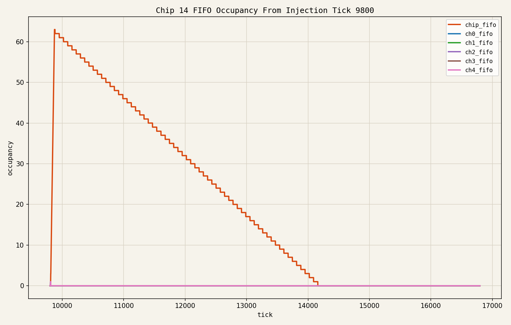
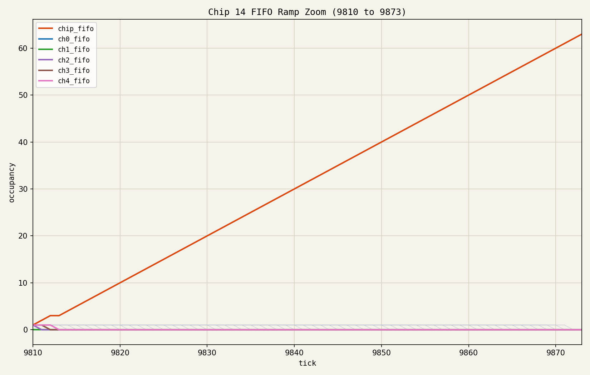
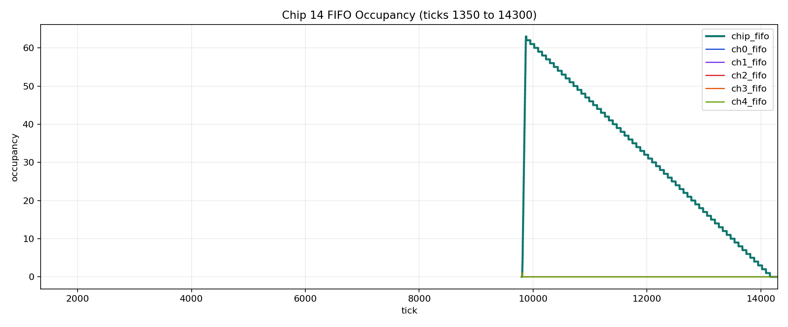

# Occupancy Notes

This note records the explanation for two questions that came up during the `3x5` all-channel natural-trigger event test on chip `14`.

## Why Didn't The Chip FIFO Immediately Overrun?

After the charge-injection timing was corrected so that all configuration writes had completed before injection, all `64` channels on chip `14` did generate local data packets. The observed result was:

- all `64` channels locally generated packets
- all `64` channels were later observed at the FPGA
- the chip-level FIFO reached a peak occupancy of `63`

The peak is `63` instead of `64` because Hydra begins draining the shared chip FIFO while channel-local FIFOs are still feeding it. In the RTL, a simultaneous FIFO write and FIFO read leaves the shared FIFO occupancy counter unchanged, rather than increasing by one.

So the result is consistent with:

- `64` channels generating packets
- one packet already being dequeued by Hydra while the remaining `63` are still queued

## Why Is There A Brief Flat Region Around Tick 9813?

The short plateau near tick `9813` is also explained by overlapping shared-FIFO enqueue and dequeue activity.

Around that region:

- active channel-local FIFO count continues to fall by one packet per tick
- chip FIFO occupancy goes `3 -> 3 -> 4`

That means channel packets are still leaving local FIFOs, but on tick `9813` Hydra also dequeues a packet from the shared FIFO in the same cycle. The net shared-FIFO occupancy therefore stays constant for one tick.

This is a real RTL timing effect, not a plotting artifact.

## Occupancy Plots

Full occupancy plot:

Zoomed occupancy plot:

Additional zoomed plot (ticks 1350 to 14300):

