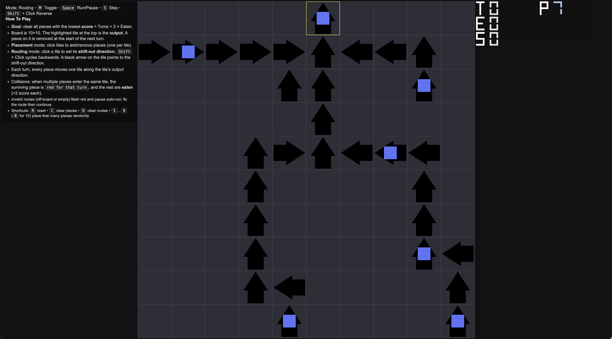

# Routing Board Game

Set each tile’s arrow to route all pieces to the top output in the fewest turns — lower score wins.

Play online: https://ymei.github.io/nifty-routing-board-game/

## Screenshot

<p align="center">
  <a href="assets/gameplay.png">
    
  </a>
  <br/>
  <em>Routing board with arrows (shift‑out direction), pieces, HUD and output tile.</em>
</p>

## Controls
- M: toggle Placement / Routing mode
- Left click: place/remove piece (Placement) or cycle tile direction (Routing)
- Shift + Left click: cycle direction backward (Routing)
- S: step one turn
- Z: step backward one turn
- Space: start/stop auto-run
- R: reset board
- C: clear all pieces
- D: clear routing map
- F: fill routing pattern (row funnel toward exit)
- G: fill routing pattern (column funnel toward exit)
- 1..9: place that many pieces randomly
- 0: place 10 random pieces

## Objective
- Route all pieces to the designated output at the top edge.
- Score = number of turns taken + 2 × number of eaten pieces. Lower is better.

## Modes
- Placement: click to add/remove pieces (one per tile).
- Routing: click to set each tile’s shift-out direction (arrow). Shift+Click cycles the direction backward.

## Rules
- Every turn, each piece moves one tile in the arrow’s direction. Pieces can move into a tile that is currently occupied (moves are simultaneous).
- If multiple pieces enter the same tile, one remains (rendered red for that turn) and the rest are eaten (+2 score each).
- Any piece on the output tile is removed at the start of the next turn.

## Run Locally
Open `index.html` using any static file server (so the WASM file can be fetched):
- Python: `python3 -m http.server 8000` then visit http://localhost:8000
- Or any other static server you prefer

## Technical build details
```
clang --target=wasm32 -O3 -nostdlib \
  -Wl,--no-entry \
  -Wl,--export=init -Wl,--export=frame -Wl,--export=set_viewport \
  -Wl,--export=on_pointer -Wl,--export=on_key \
  -Wl,--export-memory \
  -Wl,--initial-memory=2097152 -Wl,--max-memory=16777216 \
  -Wl,--export-table \
  -Wl,--allow-undefined \
  -o main.wasm app_wasm.c game.c
```
Open `index.html` in a local server (any static server). The canvas resizes to the window.

Examples
- macOS with MacPorts LLVM:
  - `make -C . CLANG=clang-mp-19`

## Runtime config (JS)
You can configure the board at runtime via query params or JS:
- Query params: `?w=12&h=8&outx=6&outy=0&seed=123&history=1024`
- JS: `window.setGameConfig({width:12, height:8, outX:6, outY:0, seed:123, history:1024});`

Notes:
- `seed=0` uses a random seed.
- Invalid configs are ignored (see console warning).
- Programmable routing: `window.setRoutingPattern(0)` for row funnel, `window.setRoutingPattern(1)` for column funnel.
