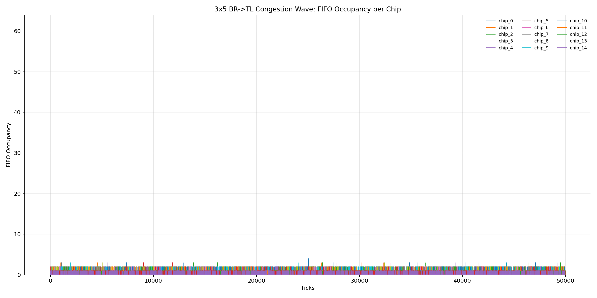

# 3x5 Congestion-Wave Report (Bottom-Right -> Top-Left)

## Run Setup

- Effective config: `/home/lxusers/k/kalindigosine/snrlab-ic-q-pix-v1/chip_network_sim/reports/congestion_wave_3x5/20260304_134405/effective_config.json`
- Run log: `/home/lxusers/k/kalindigosine/snrlab-ic-q-pix-v1/chip_network_sim/reports/congestion_wave_3x5/20260304_134405/run.log`
- Trace run dir: `/home/lxusers/k/kalindigosine/snrlab-ic-q-pix-v1/chip_network_sim/reports/congestion_wave_3x5/20260304_134405/traces/congestion_wave_3x5_20260304_134405`

## Aggregate Results

- Generated packets (trace `GEN_LOCAL`): 18674
- Forwarded packets (trace `DEQ_OUT`): 150159
- Local drops (`ENQ_LOCAL_DROP_FULL`): 0
- Pass-through drops (`ENQ_NEIGH_DROP_FULL`): 0
- Total drops (trace): 0
- Total drops (orchestrator metrics): 0
- Delivered tx (orchestrator metrics): 131488
- Cycles/sec (orchestrator benchmark): 2309.134

## Per-Chip Metrics

| Chip | Generated | Forwarded | Local Drops | Pass-through Drops | Total Drops | FIFO Peak |
| ---: | ---: | ---: | ---: | ---: | ---: | ---: |
| 0 | 1223 | 18671 | 0 | 0 | 0 | 3 |
| 1 | 1266 | 17448 | 0 | 0 | 0 | 3 |
| 2 | 1220 | 16182 | 0 | 0 | 0 | 3 |
| 3 | 1274 | 14963 | 0 | 0 | 0 | 3 |
| 4 | 1247 | 13690 | 0 | 0 | 0 | 3 |
| 5 | 1154 | 7530 | 0 | 0 | 0 | 2 |
| 6 | 1236 | 8766 | 0 | 0 | 0 | 3 |
| 7 | 1216 | 9982 | 0 | 0 | 0 | 3 |
| 8 | 1230 | 11211 | 0 | 0 | 0 | 3 |
| 9 | 1232 | 12443 | 0 | 0 | 0 | 3 |
| 10 | 1298 | 6376 | 0 | 0 | 0 | 4 |
| 11 | 1201 | 5078 | 0 | 0 | 0 | 2 |
| 12 | 1251 | 3877 | 0 | 0 | 0 | 3 |
| 13 | 1310 | 2626 | 0 | 0 | 0 | 2 |
| 14 | 1316 | 1316 | 0 | 0 | 0 | 1 |

## FIFO Occupancy Over Time

The plot below overlays all 15 chips on one axis (x=tick, y=occupancy).

## Data Files

- Per-chip metrics TSV: `/home/lxusers/k/kalindigosine/snrlab-ic-q-pix-v1/chip_network_sim/reports/congestion_wave_3x5/20260304_134405/per_chip_metrics.tsv`
- Occupancy timeseries TSV: `/home/lxusers/k/kalindigosine/snrlab-ic-q-pix-v1/chip_network_sim/reports/congestion_wave_3x5/20260304_134405/fifo_occupancy_timeseries.tsv`
