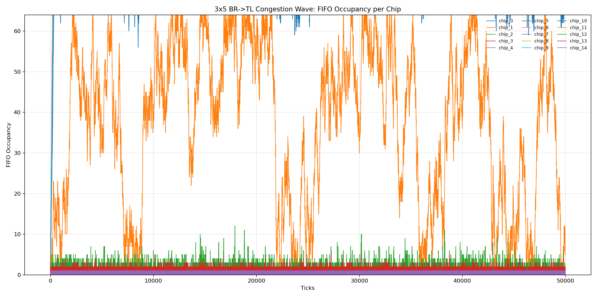

# 3x5 Congestion-Wave Report (Bottom-Right -> Top-Left)

## Run Setup

- Effective config: `/home/lxusers/k/kalindigosine/snrlab-ic-q-pix-v1/chip_network_sim/reports/congestion_wave_3x5/20260304_151636/effective_config.json`
- Run log: `/home/lxusers/k/kalindigosine/snrlab-ic-q-pix-v1/chip_network_sim/reports/congestion_wave_3x5/20260304_151636/run.log`
- Trace run dir: `/home/lxusers/k/kalindigosine/snrlab-ic-q-pix-v1/chip_network_sim/reports/congestion_wave_3x5/20260304_151636/traces/congestion_wave_3x5_20260304_151636`

## Aggregate Results

- Generated packets (trace `GEN_LOCAL`): 187277
- Forwarded packets (trace `DEQ_OUT`): 674979
- Local drops (`ENQ_LOCAL_DROP_FULL`): 0
- Pass-through drops (`ENQ_NEIGH_DROP_FULL`): 136570
- Total drops (trace): 136570
- Total drops (orchestrator metrics): 136570
- Delivered tx (orchestrator metrics): 624981
- Cycles/sec (orchestrator benchmark): 2350.045

## Per-Chip Metrics

| Chip | Generated | Forwarded | Local Drops | Pass-through Drops | Total Drops | FIFO Peak |
| ---: | ---: | ---: | ---: | ---: | ---: | ---: |
| 0 | 12502 | 49998 | 0 | 12438 | 12438 | 64 |
| 1 | 12484 | 49998 | 0 | 12419 | 12419 | 64 |
| 2 | 12392 | 49997 | 0 | 12327 | 12327 | 64 |
| 3 | 12488 | 49996 | 0 | 12425 | 12425 | 64 |
| 4 | 12327 | 49997 | 0 | 12262 | 12262 | 64 |
| 5 | 12430 | 49998 | 0 | 12365 | 12365 | 64 |
| 6 | 12573 | 49998 | 0 | 12509 | 12509 | 64 |
| 7 | 12367 | 49997 | 0 | 12304 | 12304 | 64 |
| 8 | 12587 | 49997 | 0 | 12523 | 12523 | 64 |
| 9 | 12428 | 49996 | 0 | 12365 | 12365 | 64 |
| 10 | 12430 | 49997 | 0 | 12158 | 12158 | 64 |
| 11 | 12579 | 49789 | 0 | 475 | 475 | 64 |
| 12 | 12610 | 37690 | 0 | 0 | 0 | 12 |
| 13 | 12629 | 25080 | 0 | 0 | 0 | 5 |
| 14 | 12451 | 12451 | 0 | 0 | 0 | 1 |

## FIFO Occupancy Over Time

The plot below overlays all 15 chips on one axis (x=tick, y=occupancy).

## Data Files

- Per-chip metrics TSV: `/home/lxusers/k/kalindigosine/snrlab-ic-q-pix-v1/chip_network_sim/reports/congestion_wave_3x5/20260304_151636/per_chip_metrics.tsv`
- Occupancy timeseries TSV: `/home/lxusers/k/kalindigosine/snrlab-ic-q-pix-v1/chip_network_sim/reports/congestion_wave_3x5/20260304_151636/fifo_occupancy_timeseries.tsv`
