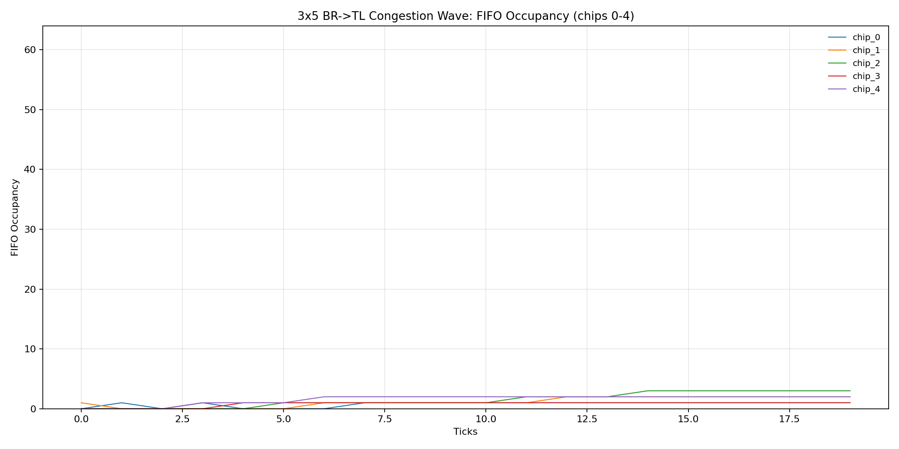
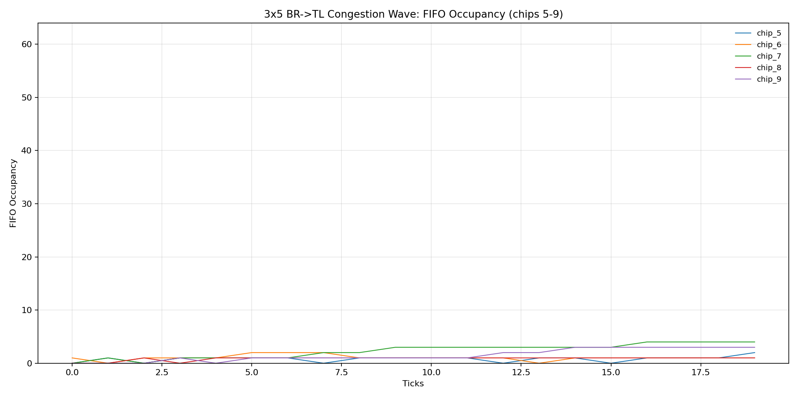
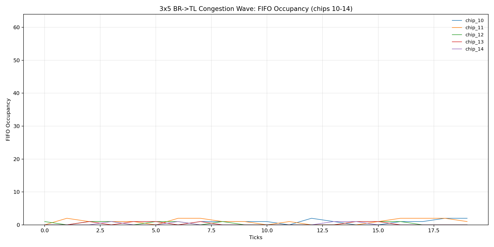

# 3x5 Congestion-Wave Report (Bottom-Right -> Top-Left)

## Run Setup

- Effective config: `reports/congestion_wave_3x5/waveform_focus_20260306/effective_config.json`
- Run log: `reports/congestion_wave_3x5/waveform_focus_20260306/run.log`
- Trace run dir: `reports/congestion_wave_3x5/waveform_focus_20260306/traces/congestion_wave_3x5_20260306_110019`

## Aggregate Results

- Generated packets (trace `GEN_LOCAL`): 37
- Forwarded packets (trace `DEQ_OUT`): 197
- Local drops (`ENQ_LOCAL_DROP_FULL`): 0
- Pass-through drops (`ENQ_NEIGH_DROP_FULL`): 0
- Total drops (trace): 0
- Total drops (orchestrator metrics): 0
- Delivered tx (orchestrator metrics): 183
- Cycles/sec (orchestrator benchmark): 32.049

## Per-Chip Metrics

| Chip | Generated | Forwarded | Local Drops | Pass-through Drops | Total Drops | FIFO Peak |
| ---: | ---: | ---: | ---: | ---: | ---: | ---: |
| 0 | 1 | 14 | 0 | 0 | 0 | 1 |
| 1 | 2 | 14 | 0 | 0 | 0 | 2 |
| 2 | 2 | 14 | 0 | 0 | 0 | 3 |
| 3 | 0 | 15 | 0 | 0 | 0 | 1 |
| 4 | 3 | 16 | 0 | 0 | 0 | 2 |
| 5 | 3 | 14 | 0 | 0 | 0 | 2 |
| 6 | 4 | 17 | 0 | 0 | 0 | 2 |
| 7 | 4 | 17 | 0 | 0 | 0 | 4 |
| 8 | 0 | 16 | 0 | 0 | 0 | 1 |
| 9 | 2 | 15 | 0 | 0 | 0 | 3 |
| 10 | 2 | 13 | 0 | 0 | 0 | 2 |
| 11 | 5 | 13 | 0 | 0 | 0 | 2 |
| 12 | 3 | 9 | 0 | 0 | 0 | 1 |
| 13 | 2 | 6 | 0 | 0 | 0 | 1 |
| 14 | 4 | 4 | 0 | 0 | 0 | 1 |

## FIFO Occupancy Over Time

The plots below show FIFO occupancy vs tick, grouped as 5 chips per axis.

### `fifo_occupancy_chips_0_4`

### `fifo_occupancy_chips_5_9`

### `fifo_occupancy_chips_10_14`

## Data Files

- Per-chip metrics TSV: `reports/congestion_wave_3x5/waveform_focus_20260306/per_chip_metrics.tsv`
- Occupancy timeseries TSV: `reports/congestion_wave_3x5/waveform_focus_20260306/fifo_occupancy_timeseries.tsv`
