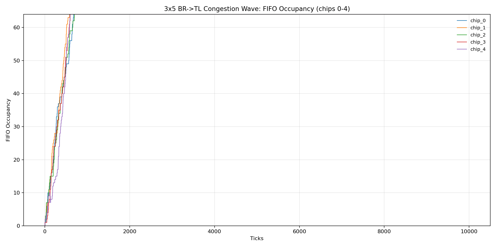
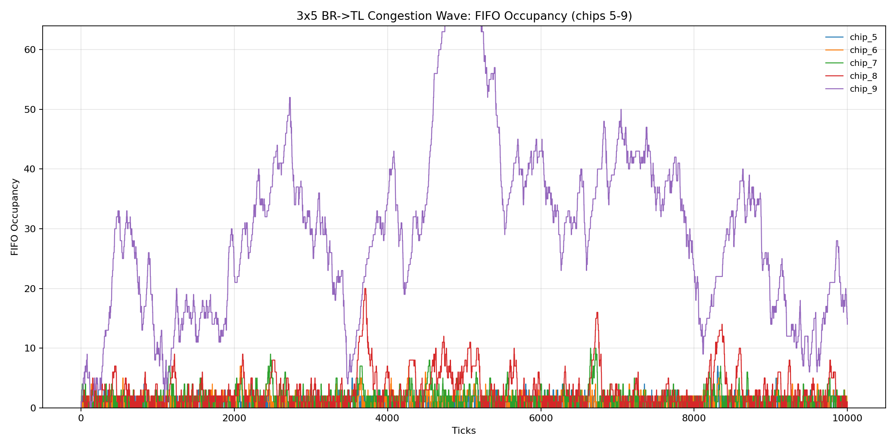
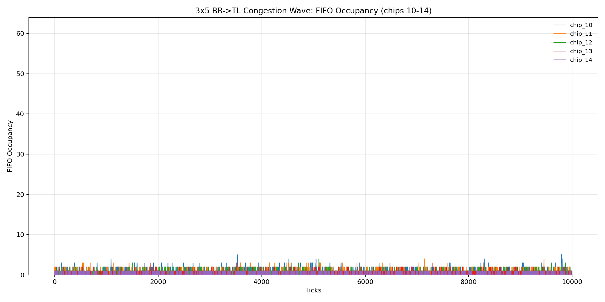

# 3x5 Congestion-Wave Report (Bottom-Right -> Top-Left)

## Run Setup

- Effective config: `reports/congestion_wave_3x5/waveform_focus_20260306_10k/effective_config.json`
- Run log: `reports/congestion_wave_3x5/waveform_focus_20260306_10k/run.log`
- Trace run dir: `reports/congestion_wave_3x5/waveform_focus_20260306_10k/traces/congestion_wave_3x5_20260306_115157`

## Aggregate Results

- Generated packets (trace `GEN_LOCAL`): 14973
- Forwarded packets (trace `DEQ_OUT`): 105032
- Local drops (`ENQ_LOCAL_DROP_FULL`): 0
- Pass-through drops (`ENQ_NEIGH_DROP_FULL`): 4644
- Total drops (trace): 4644
- Total drops (orchestrator metrics): 4644
- Delivered tx (orchestrator metrics): 95038
- Cycles/sec (orchestrator benchmark): 1547.219

## Per-Chip Metrics

| Chip | Generated | Forwarded | Local Drops | Pass-through Drops | Total Drops | FIFO Peak |
| ---: | ---: | ---: | ---: | ---: | ---: | ---: |
| 0 | 993 | 9994 | 0 | 929 | 929 | 64 |
| 1 | 995 | 9994 | 0 | 931 | 931 | 64 |
| 2 | 953 | 9994 | 0 | 890 | 890 | 64 |
| 3 | 925 | 9995 | 0 | 862 | 862 | 64 |
| 4 | 1059 | 9996 | 0 | 990 | 990 | 64 |
| 5 | 981 | 5972 | 0 | 0 | 0 | 7 |
| 6 | 1052 | 7024 | 0 | 0 | 0 | 7 |
| 7 | 1046 | 8070 | 0 | 0 | 0 | 10 |
| 8 | 978 | 9047 | 0 | 0 | 0 | 20 |
| 9 | 1000 | 9991 | 0 | 42 | 42 | 64 |
| 10 | 1017 | 4991 | 0 | 0 | 0 | 5 |
| 11 | 958 | 3974 | 0 | 0 | 0 | 4 |
| 12 | 1009 | 3016 | 0 | 0 | 0 | 4 |
| 13 | 1040 | 2007 | 0 | 0 | 0 | 3 |
| 14 | 967 | 967 | 0 | 0 | 0 | 1 |

## FIFO Occupancy Over Time

The plots below show FIFO occupancy vs tick, grouped as 5 chips per axis.

### `fifo_occupancy_chips_0_4`

### `fifo_occupancy_chips_5_9`

### `fifo_occupancy_chips_10_14`

## Data Files

- Per-chip metrics TSV: `reports/congestion_wave_3x5/waveform_focus_20260306_10k/per_chip_metrics.tsv`
- Occupancy timeseries TSV: `reports/congestion_wave_3x5/waveform_focus_20260306_10k/fifo_occupancy_timeseries.tsv`
