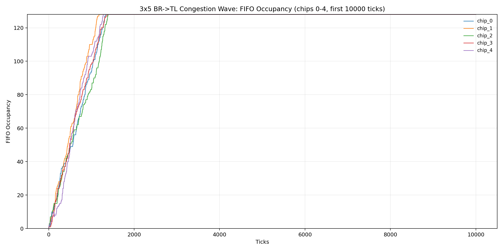
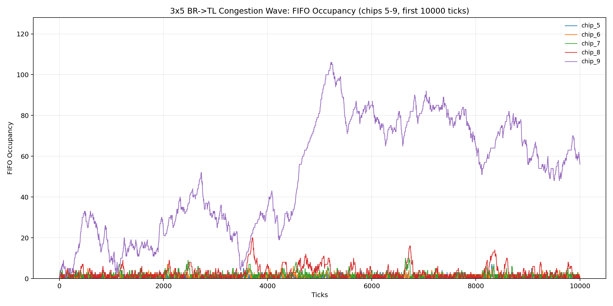
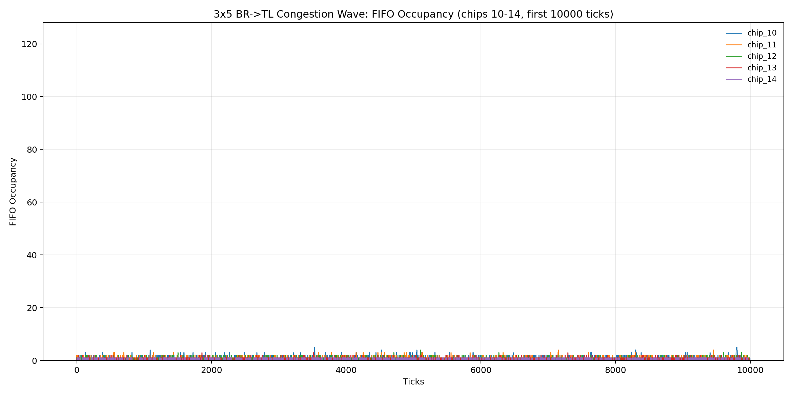

# 3x5 Congestion-Wave Report (Bottom-Right -> Top-Left)

## Run Setup

- Effective config: `reports/congestion_wave_3x5/waveform_focus_fifo128/effective_config.json`
- Run log: `reports/congestion_wave_3x5/waveform_focus_fifo128/run.log`
- Trace run dir: `reports/congestion_wave_3x5/waveform_focus_fifo128/traces/congestion_wave_3x5_20260308_225022`

## Aggregate Results

- Generated packets (trace `GEN_LOCAL`): 74775
- Forwarded packets (trace `DEQ_OUT`): 524773
- Local drops (`ENQ_LOCAL_DROP_FULL`): 0
- Pass-through drops (`ENQ_NEIGH_DROP_FULL`): 24102
- Total drops (trace): 24102
- Total drops (orchestrator metrics): 24102
- Delivered tx (orchestrator metrics): 474779
- Cycles/sec (orchestrator benchmark): 2174.128

## Per-Chip Metrics

| Chip | Generated | Forwarded | Local Drops | Pass-through Drops | Total Drops | FIFO Peak |
| ---: | ---: | ---: | ---: | ---: | ---: | ---: |
| 0 | 5068 | 49994 | 0 | 4940 | 4940 | 128 |
| 1 | 4970 | 49994 | 0 | 4842 | 4842 | 128 |
| 2 | 4926 | 49994 | 0 | 4799 | 4799 | 128 |
| 3 | 4978 | 49995 | 0 | 4851 | 4851 | 128 |
| 4 | 4910 | 49996 | 0 | 4614 | 4614 | 128 |
| 5 | 4891 | 29919 | 0 | 0 | 0 | 8 |
| 6 | 5072 | 34991 | 0 | 0 | 0 | 11 |
| 7 | 4974 | 39963 | 0 | 0 | 0 | 22 |
| 8 | 5029 | 44990 | 0 | 0 | 0 | 27 |
| 9 | 4928 | 49828 | 0 | 56 | 56 | 128 |
| 10 | 5069 | 25028 | 0 | 0 | 0 | 5 |
| 11 | 4898 | 19959 | 0 | 0 | 0 | 4 |
| 12 | 4970 | 15062 | 0 | 0 | 0 | 4 |
| 13 | 5124 | 10092 | 0 | 0 | 0 | 4 |
| 14 | 4968 | 4968 | 0 | 0 | 0 | 1 |

## FIFO Occupancy Over Time

The plots below show FIFO occupancy vs tick, grouped as 5 chips per axis.

### `fifo_occupancy_chips_0_4`

### `fifo_occupancy_chips_5_9`

### `fifo_occupancy_chips_10_14`

## Data Files

- Per-chip metrics TSV: `reports/congestion_wave_3x5/waveform_focus_fifo128/per_chip_metrics.tsv`
- Occupancy timeseries TSV: `reports/congestion_wave_3x5/waveform_focus_fifo128/fifo_occupancy_timeseries.tsv`
